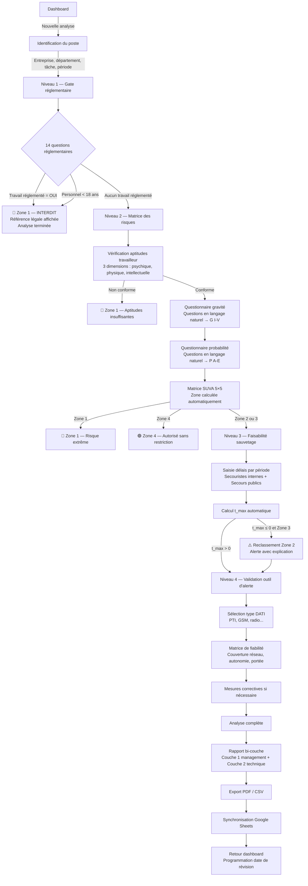
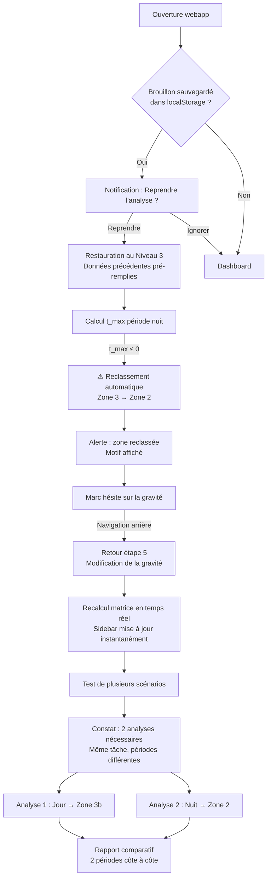
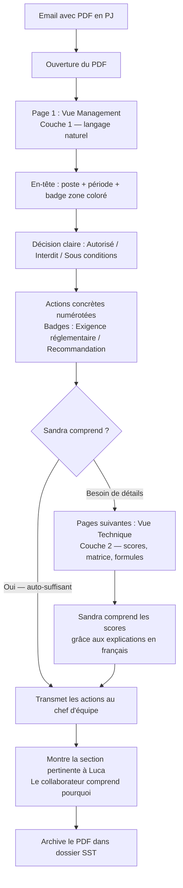
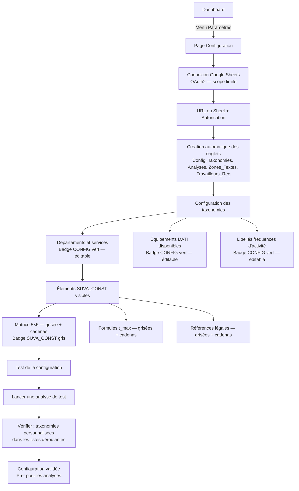
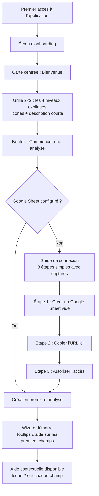

# UX Design Specification — Analyse Travailleurs Isolés - SUVA 44094.F

**Author:** Pierre-Alain
**Date:** 2026-03-16

---

## Executive Summary

### Vision projet

L'Analyse Travailleurs Isolés est le premier outil digital suisse conforme à la méthode SUVA 44094.F. Du point de vue UX, le défi central est de rendre accessible une méthode réglementaire complexe (4 niveaux séquentiels, gates GO/NO-GO, matrice 5×5, calculs de t_max) à travers une interface simple et guidée. L'utilisateur ne doit jamais manipuler de codes techniques — il répond à des questions en langage naturel et l'outil produit des décisions réglementaires explicites.

L'unité d'analyse est la combinaison TÂCHE × PÉRIODE, ce qui implique des patterns UX de duplication et de comparaison entre analyses d'un même poste.

### Utilisateurs cibles

**Marc (spécialiste STPS)** — Utilisateur primaire. Conduit l'analyse via le wizard, sur desktop ou tablette terrain. Connaît la méthode SUVA mais attend un outil qui calcule, décide et justifie à sa place. Son moment "aha!" : quand le rapport produit une conclusion claire avec des mesures concrètes et que le cadre comprend sans poser de questions.

**Sandra (responsable d'exploitation)** — Destinataire du rapport. Ne touche jamais l'outil. Attend un document qui dit "autorisé ou interdit" avec les actions exactes à mettre en place. Le rapport couche 1 est son interface avec le système.

**Luca (collaborateur terrain)** — Impacté par les conclusions. Le rapport doit pouvoir lui être montré et être compréhensible en une lecture.

### Défis UX clés

1. **Complexité cachée** — 4 niveaux réglementaires, reclassements automatiques et calculs doivent être transparents sans noyer l'utilisateur
2. **Double audience du rapport** — Langage naturel (Sandra) + détail technique (Marc) dans un même document, sans friction
3. **Distinction [SUVA_CONST] / [CONFIG]** — Rendre visible ce qui est imposé par la loi vs configurable, sans surcharger l'interface
4. **Usage terrain tablette** — Zones de tap généreuses, mode offline transparent, formulaire sans zoom ni scroll horizontal
5. **Navigation libre dans un wizard séquentiel** — Retour arrière avec recalcul temps réel malgré la logique séquentielle des gates

### Opportunités UX

1. **Feedback progressif** — Sidebar résumé temps réel + badges de zone qui apparaissent dès données suffisantes → expérience satisfaisante et motivante
2. **Vulgarisation comme différenciateur** — Questionnaires en langage naturel qui calculent les codes techniques en coulisses = avantage compétitif UX majeur
3. **Rapport comme outil de communication** — Badges colorés, actions numérotées, distinction exigence/recommandation → Sandra comprend sans aide

## Core User Experience

### Expérience définissante

L'expérience cœur est la **boucle question → réponse → feedback**. Marc répond à des questions en langage naturel, et la sidebar met à jour en temps réel la zone de risque, les mesures requises et l'avancement de l'analyse. Chaque réponse a un impact visible et immédiat. L'outil ne se contente pas de collecter des données — il calcule, décide et communique en continu.

L'action la plus fréquente : parcourir le wizard étape par étape. L'action la plus critique : le moment où un gate GO/NO-GO se déclenche et stoppe l'analyse avec un motif légal. Ce moment doit être clair, non-ambigu et rassurant (pas punitif) — Marc doit comprendre immédiatement pourquoi l'analyse s'arrête et quelle est la conséquence.

### Stratégie de plateforme

| Dimension | Décision | Rationale |
|-----------|----------|-----------|
| **Plateforme primaire** | Web app (SPA) | Déploiement instantané, zéro installation, accessible depuis n'importe quel device |
| **Device prioritaire** | Desktop + tablette (iPad) | Desktop pour les analyses au bureau, tablette pour les visites terrain |
| **Input primaire** | Souris/clavier (desktop) + touch (tablette) | Zones de tap ≥ 44px pour le tactile, navigation clavier complète pour le desktop |
| **Offline** | Transparent — localStorage primaire | Marc ne doit jamais savoir qu'il est hors-ligne. La synchronisation Google Sheets se fait quand la connexion revient |
| **Responsive** | Desktop ≥1024px (wizard + sidebar côte à côte), tablette 768-1023px (sidebar en drawer), portrait <768px (sidebar toggle) |

### Interactions sans friction

| Interaction | Comportement attendu |
|-------------|---------------------|
| **Sauvegarde** | Automatique et invisible — jamais de bouton "Sauvegarder". localStorage toutes les 30s + à chaque changement d'étape |
| **Navigation wizard** | Retour arrière libre, recalcul instantané. Pas de confirmation "êtes-vous sûr ?" — les données sont toujours préservées |
| **Questionnaires intermédiaires** | Marc répond à 3-4 questions simples → le code technique (P1-P4, C1-C3) est calculé automatiquement. Il ne voit jamais le code, seulement le résultat en langage clair |
| **Gate NO-GO** | Détection automatique → affichage immédiat du motif légal + référence SUVA. Pas besoin de valider manuellement |
| **Reprise d'analyse** | Ouvrir l'app → l'analyse interrompue est là, exactement où Marc l'avait laissée |
| **Export PDF** | Un clic → PDF généré côté client en < 5s, prêt à envoyer |

### Moments critiques de succès

1. **Premier gate NO-GO** — Marc coche "Travaux en réservoirs" → l'analyse affiche immédiatement **Zone 1 — INTERDIT** avec la référence SUVA exacte. C'est le moment où il réalise que l'outil fait le travail de décision à sa place. Si ce moment est confus ou lent, la confiance est perdue.

2. **Résultat de la matrice** — Après les questionnaires de gravité et probabilité, la matrice 5×5 s'affiche avec la cellule mise en évidence et la zone résultante. Marc voit visuellement où il se situe. Ce moment doit être satisfaisant — une matrice interactive, pas un simple texte.

3. **Reclassement automatique** — Au Niveau 3, si t_max ≤ 0, l'outil reclasse automatiquement en Zone 2 avec une explication claire. Marc comprend pourquoi sans devoir recalculer manuellement. Ce moment transforme la complexité réglementaire en intelligence automatisée.

4. **Rapport généré** — Marc voit le rapport bi-couche pour la première fois. La couche 1 est lisible par Sandra sans aide. C'est le moment "aha!" — pour la première fois, il a un rapport qu'il peut envoyer directement.

5. **Sandra lit le rapport** — Sandra ouvre le PDF, voit un badge coloré + des actions numérotées + une distinction claire exigence/recommandation. Elle comprend sans appeler Marc. Ce n'est pas un moment dans l'app, mais c'est LE moment de succès du produit.

### Principes d'expérience

| # | Principe | Application |
|---|----------|-------------|
| **P1** | **L'outil décide, l'humain valide** | L'outil ne demande jamais "quelle zone choisissez-vous ?" — il calcule la zone et l'affiche. Marc valide ou corrige les données d'entrée, pas les résultats. |
| **P2** | **Langage naturel d'abord** | Aucun code technique visible dans le parcours principal. Les codes (P1-P4, C1-C3, Zone 1-4) existent en coulisses mais l'utilisateur interagit en français clair. |
| **P3** | **Feedback continu, pas final** | La sidebar ne se remplit pas à la fin — elle évolue à chaque étape. L'utilisateur voit toujours où il en est et quel sera l'impact de sa prochaine réponse. |
| **P4** | **Confiance par la transparence** | Chaque décision automatique affiche son motif et sa référence légale. L'utilisateur ne doit jamais se demander "pourquoi l'outil a décidé ça ?". |
| **P5** | **Deux langages, un document** | Le rapport parle à Marc ET Sandra dans le même PDF, sans mode à switcher. La couche 1 (actions) est en haut, la couche 2 (technique) est en dessous. |

## Desired Emotional Response

### Objectifs émotionnels primaires

| Utilisateur | Émotion primaire | Ce qui la déclenche |
|-------------|-----------------|---------------------|
| **Marc** | **Confiance professionnelle** — "Je suis sûr de mon analyse" | L'outil produit des décisions avec références légales exactes. Marc sait que ses conclusions sont défendables |
| **Marc** | **Efficacité valorisante** — "J'ai fait en 20 min ce qui me prenait 3h" | Le gain de temps est tangible, visible, et la qualité du résultat est supérieure à sa méthode manuelle |
| **Sandra** | **Clarté rassurante** — "Je comprends ce que je dois faire" | Le rapport couche 1 élimine l'incertitude. Actions concrètes, pas de jargon |
| **Luca** | **Respect** — "On m'explique pourquoi, pas juste ce qu'on m'impose" | Le rapport est lisible et donne les raisons derrière chaque mesure |

### Parcours émotionnel

| Moment | Émotion visée | Anti-émotion à éviter |
|--------|--------------|----------------------|
| **Découverte / onboarding** | Curiosité maîtrisée — "C'est simple, je comprends la méthode" | Intimidation — "C'est trop complexe pour moi" |
| **Gate NO-GO (Zone 1 forcée)** | Certitude — "L'outil a raison, c'est clair et justifié" | Frustration — "Pourquoi ça m'empêche de continuer ?" |
| **Questionnaires intermédiaires** | Fluidité — "Je réponds naturellement, ça avance tout seul" | Doute — "Est-ce que ma réponse est correcte ?" |
| **Résultat matrice** | Satisfaction visuelle — "Je vois où je me situe" | Confusion — "Qu'est-ce que ça veut dire ?" |
| **Reclassement automatique** | Sécurité — "L'outil a détecté un problème que j'aurais pu rater" | Surprise négative — "Pourquoi ça a changé sans me demander ?" |
| **Rapport généré** | Fierté professionnelle — "C'est professionnel, je peux l'envoyer tel quel" | Déception — "Je dois encore le retoucher" |
| **Erreur / problème** | Contrôle — "Je comprends ce qui se passe et comment corriger" | Panique — "J'ai perdu mon travail" |
| **Retour dans l'app** | Familiarité — "Tout est là où je l'ai laissé" | Désorientation — "Où en étais-je ?" |

### Micro-émotions critiques

**Confiance > Scepticisme** — C'est LA micro-émotion centrale. Marc est un professionnel SST qui met sa crédibilité en jeu avec chaque analyse. Si l'outil produit un résultat qu'il ne peut pas vérifier ou expliquer, il retourne à son Excel. La transparence (motif + référence légale à chaque décision) est le mécanisme de construction de confiance.

**Accomplissement > Frustration** — Chaque étape complétée du wizard doit donner un sentiment de progression. La barre de progression et la sidebar résumé sont les véhicules de cette micro-émotion. L'utilisateur ne doit jamais se sentir "coincé" — la navigation libre et les tooltips d'aide éliminent les impasses.

**Calme > Anxiété** — Le domaine réglementaire peut être anxiogène (conséquences légales en cas d'erreur). L'outil doit rassurer par son exactitude, pas stresser par sa complexité. Tons neutres, messages informatifs (pas alarmistes), références légales accessibles (pas imposées).

### Implications design

| Émotion visée | Décision UX |
|--------------|-------------|
| **Confiance** | Chaque résultat calculé affiche son motif et sa référence SUVA en tooltip accessible. Les constantes réglementaires portent un badge visuel "SUVA" non modifiable |
| **Efficacité** | Barre de progression visible, estimation du temps restant, transitions instantanées entre étapes (< 100ms) |
| **Clarté (Sandra)** | Badge coloré de zone en tête de rapport, actions numérotées en langage clair, distinction visuelle exigence vs recommandation |
| **Contrôle (erreur)** | Messages d'erreur en français clair avec action corrective. Jamais de message technique. Toujours une sortie ("Modifier la réponse" / "Revenir à l'étape X") |
| **Calme** | Palette de couleurs professionnelle (pas de rouge agressif sauf Zone 1). Typographie lisible (Inter). Espacement généreux. Pas de surcharge d'informations — progressive disclosure |
| **Fierté (rapport)** | Mise en page PDF soignée, en-tête professionnel, matrice en couleur, référence SUVA en pied de page. Le rapport doit "faire sérieux" quand Sandra le reçoit |

### Principes de design émotionnel

| # | Principe | Règle |
|---|----------|-------|
| **E1** | **Rassurer, pas alarmer** | Les gates NO-GO informent avec autorité mais sans ton alarmiste. "Zone 1 — Travail isolé interdit" est factuel, pas "ATTENTION DANGER". La référence légale justifie, le ton reste neutre |
| **E2** | **Progression visible = motivation** | L'utilisateur doit toujours voir combien il a fait et combien il reste. La sidebar résumé ET la barre de progression créent un double signal de progression |
| **E3** | **L'erreur est normale** | Modifier une réponse, revenir en arrière, tester un scénario — ce sont des comportements attendus, pas des erreurs. L'interface ne doit jamais punir l'exploration |
| **E4** | **Le rapport est le héros** | La fierté de Marc vient du rapport qu'il produit, pas de l'outil qu'il utilise. L'UX du wizard est au service de la qualité du rapport final |
| **E5** | **Professionnalisme silencieux** | Pas d'animations excessives, pas de gamification, pas de célébrations. L'outil est un instrument professionnel qui inspire confiance par sa sobriété et sa précision |

## UX Pattern Analysis & Inspiration

### Analyse de produits inspirants

**1. TurboTax / Wundertax — Wizard fiscal guidé**

TurboTax transforme la déclaration d'impôts (domaine réglementaire complexe) en conversation guidée. L'utilisateur ne voit jamais les formulaires fiscaux bruts — il répond à des questions en langage naturel et l'outil remplit les formulaires en coulisses.

| Ce qui fonctionne | Application pour notre projet |
|-------------------|-------------------------------|
| Questions en langage naturel → codes fiscaux calculés automatiquement | Exactement notre pattern de vulgarisation computationnelle (probabilité, charge cognitive) |
| Barre de progression avec estimation de temps | Sidebar + barre de progression du wizard |
| Résumé en temps réel du résultat (remboursement estimé) | Sidebar résumé avec zone de risque mise à jour en continu |
| Retour arrière libre sans perte de données | Navigation libre dans le wizard avec recalcul instantané |

**2. Typeform — Formulaire conversationnel**

Typeform a popularisé le pattern "une question à la fois" qui réduit la charge cognitive et augmente le taux de complétion.

| Ce qui fonctionne | Application pour notre projet |
|-------------------|-------------------------------|
| Focus sur une question à la fois | Chaque étape du wizard = un bloc cohérent, pas un formulaire dense |
| Transitions fluides entre questions | Transitions < 100ms entre étapes du wizard |
| Feedback immédiat après chaque réponse | Gate NO-GO immédiat, recalcul sidebar en temps réel |
| Progression visible et motivante | Barre de progression + sidebar résumé |

**3. Notion / Linear — Gestion de projets avec niveaux de détail**

Ces outils maîtrisent le pattern de progressive disclosure — l'information est structurée en couches, de la vue d'ensemble au détail.

| Ce qui fonctionne | Application pour notre projet |
|-------------------|-------------------------------|
| Vue liste résumée → vue détaillée en un clic | Dashboard analyses → détail analyse → rapport complet |
| Badges de statut colorés | Badges de zone Z1-Z4 avec code couleur |
| Filtres et recherche rapides | Dashboard avec filtres par entreprise, zone, statut |
| Sidebar contextuelle | Sidebar résumé du wizard |

**4. DocuSign / HelloSign — Workflow réglementaire avec signature**

Ces outils transforment un processus légal (signature de contrats) en expérience fluide avec guidage clair.

| Ce qui fonctionne | Application pour notre projet |
|-------------------|-------------------------------|
| Guidage visuel "signez ici" avec flèches | Guidage contextuel "répondez à cette question" avec tooltips |
| Export PDF professionnel et soigné | Rapport PDF bi-couche avec mise en page professionnelle |
| Distinction entre éléments requis et optionnels | Distinction [SUVA_CONST] (verrouillé) vs [CONFIG] (modifiable) |
| Statuts clairs : brouillon / en cours / complété | Statuts d'analyse : BROUILLON / COMPLET / VALIDÉ |

### Patterns UX transférables

**Patterns de navigation :**

| Pattern | Source | Application |
|---------|--------|-------------|
| **Wizard progressif avec sidebar résumé** | TurboTax | Layout desktop : wizard à gauche, sidebar résumé à droite. La sidebar évolue en temps réel |
| **Stepper vertical avec indicateurs d'état** | Multi-step forms best practices | Barre latérale ou en-tête montrant les 4 niveaux + les étapes dans chaque niveau. États : complété / en cours / à venir / bloqué (gate NO-GO) |
| **Breadcrumb de niveaux** | Wizard patterns | Niveau 1 → Niveau 2 → Niveau 3 → Niveau 4 avec indication de la gate active |

**Patterns d'interaction :**

| Pattern | Source | Application |
|---------|--------|-------------|
| **Progressive disclosure** | Notion/Linear | Les détails techniques (codes, références) sont accessibles en tooltip ou section dépliable — jamais imposés dans le flux principal |
| **Inline validation avec feedback positif** | Typeform | Chaque réponse validée affiche un feedback discret (check vert). Les erreurs sont expliquées en français clair |
| **Matrice interactive** | Risk assessment tools | La matrice SUVA 5×5 est cliquable/hoverable. La cellule active est mise en évidence. Les zones sont colorées |
| **Card-based alerts** | Design systems (Shadcn) | Les gates NO-GO s'affichent dans des cartes d'alerte avec icône, titre, motif et référence légale |

**Patterns visuels :**

| Pattern | Source | Application |
|---------|--------|-------------|
| **Badge coloré sémantique** | Linear/GitHub | Badges Z1 (rouge), Z2 (orange), Z3a/3b (ambre), Z4 (vert) — couleur = signification immédiate |
| **Icône cadenas pour les éléments verrouillés** | Formulaires admin | Les constantes [SUVA_CONST] portent un petit cadenas + tooltip "Constante réglementaire SUVA — non modifiable" |
| **Rapport en sections visuelles distinctes** | DocuSign/PDF professionnels | En-tête avec badge zone, section actions numérotées, section technique en retrait visuel |

### Anti-patterns à éviter

| Anti-pattern | Pourquoi l'éviter | Alternative |
|-------------|-------------------|-------------|
| **Formulaire monolithique** | Un écran avec 58 champs → abandon garanti. Marc ferme l'onglet en 30 secondes | Wizard multi-step, une section logique par écran |
| **Codes techniques exposés** | Afficher "P3" ou "C2" sans contexte → confusion, perte de confiance | Toujours afficher le libellé en langage naturel, code technique en tooltip si nécessaire |
| **Messages d'erreur en rouge agressif partout** | Stress inutile dans un domaine déjà anxiogène | Tons neutres pour les informations, rouge réservé à Zone 1 (interdiction réglementaire) |
| **Sauvegarde manuelle** | Bouton "Sauvegarder" → risque de perte de données, charge mentale | Sauvegarde automatique transparente (localStorage 30s) |
| **Confirmation modale à chaque action** | "Êtes-vous sûr ?" → friction inutile, patronizing | Retour arrière libre, undo au lieu de confirmation |
| **PDF générique sans mise en forme** | Un export brut avec du texte monospace → Sandra ne le lit pas | PDF avec mise en page professionnelle, badges couleur, sections claires |
| **Aide contextuelle en popup bloquante** | Modal d'aide qui masque le formulaire → interruption du flux | Tooltip non-bloquant, panneau latéral d'aide optionnel |

### Stratégie d'inspiration

**À adopter directement :**
- Pattern TurboTax : wizard guidé avec sidebar résumé en temps réel — c'est le cœur de l'expérience
- Pattern Typeform : transitions fluides, une section par écran, feedback immédiat
- Badges colorés sémantiques (Linear) pour les zones Z1-Z4

**À adapter :**
- Progressive disclosure (Notion) → adaptée au contexte réglementaire : la couche langage naturel est visible par défaut, la couche technique est accessible en un clic/tooltip
- Matrice interactive → adaptée à la matrice SUVA 5×5 avec mise en évidence de la cellule résultante et coloration par zone
- Card alerts (Shadcn) → adaptées pour les gates NO-GO avec ton factuel (pas alarmiste)

**À éviter :**
- Gamification / animations festives — incompatibles avec le professionnalisme silencieux (E5)
- Onboarding trop long — 3 écrans max comme défini dans le PRD (FR44)
- Mode sombre — pas prioritaire pour un outil métier utilisé en conditions terrain variées

## Design System Foundation

### Choix du design system

**Shadcn UI** — Système thématisable basé sur Radix UI primitives, copié dans le projet et stylé via TailwindCSS v4.

Ce n'est ni un framework UI classique (comme MUI ou Ant Design), ni un design system custom from scratch. Shadcn UI fournit des composants accessibles et non-opinionnés que l'on copie dans `/src/components/ui/` et qu'on adapte librement. Pas de lock-in, pas de dépendance runtime.

### Rationale de sélection

| Critère | Évaluation | Notes |
|---------|-----------|-------|
| **Accessibilité** | Excellente | Radix UI fournit ARIA, navigation clavier, focus management par défaut — critique pour WCAG 2.1 AA (NFR13-17) |
| **Personnalisation** | Totale | Composants copiés dans le projet, stylés via Tailwind — aucune contrainte visuelle imposée |
| **Performance** | Optimale | Pas de CSS-in-JS runtime, tree-shaking natif, bundle minimal — supporte NFR1 (< 200KB gzip) |
| **Vitesse de développement** | Rapide | CLI `npx shadcn add` pour scaffolder les composants de base, focus sur les composants métier custom |
| **Maintenance** | Faible | Composants locaux = pas de breaking changes externes. Mises à jour sélectives |
| **Cohérence avec la stack** | Parfaite | React 19 + TailwindCSS v4 + Vite 8 — tout est aligné (architecture validée) |

### Approche d'implémentation

**Couche 1 — Composants Shadcn UI (base) :**

Composants déjà définis dans l'architecture, scaffoldés via CLI :

| Composant | Usage principal |
|-----------|----------------|
| `Button` | Actions wizard (Suivant, Précédent, Exporter) |
| `Card` | Conteneurs d'étapes wizard, cartes d'alerte gate NO-GO |
| `Dialog` | Confirmations critiques (suppression analyse) |
| `Badge` | Badges de zone Z1-Z4, statuts d'analyse |
| `Tooltip` | Aide contextuelle SUVA sur chaque champ (FR42) |
| `Tabs` | Rapport bi-couche (couche 1 / couche 2) |
| `Input`, `Select`, `Checkbox`, `Radio-group`, `Textarea` | Champs du wizard |
| `Progress` | Barre de progression du wizard |
| `Skeleton` | États de chargement |
| `Form` | Intégration React Hook Form + Zod |
| `Separator` | Séparation visuelle des sections |

**Couche 2 — Composants métier custom :**

| Composant | Description | Basé sur |
|-----------|-------------|----------|
| `ZoneBadge` | Badge coloré Z1 (rouge) / Z2 (orange) / Z3a-3b (ambre) / Z4 (vert) avec libellé | `Badge` Shadcn |
| `SuvaTooltip` | Tooltip d'aide contextuelle avec référence SUVA et exemple | `Tooltip` Shadcn |
| `RegulatoryLock` | Icône cadenas + tooltip "Constante réglementaire SUVA" pour les éléments [SUVA_CONST] | `Tooltip` + icône |
| `RiskMatrix` | Matrice SUVA 5×5 interactive avec mise en évidence de la cellule active | Custom (grid CSS) |
| `GateAlert` | Carte d'alerte gate NO-GO avec icône, titre, motif et référence légale | `Card` Shadcn |
| `WizardSidebar` | Sidebar résumé temps réel avec progression et résultats partiels | Custom |
| `WizardStepper` | Navigation entre étapes avec indicateurs d'état (complété / en cours / bloqué) | Custom |

### Stratégie de personnalisation

**Design tokens (TailwindCSS v4 `@theme {}`) :**

| Token | Valeur | Usage |
|-------|--------|-------|
| **Couleur primaire** | Orange SUVA `#E36C09` | Actions principales, accents, liens |
| **Zone 1** | Rouge foncé `#C00000` | Badge Z1, alertes interdiction |
| **Zone 2** | Orange vif `#FF8C00` | Badge Z2, alertes vigilance élevée |
| **Zone 3a/3b** | Jaune ambre `#FFC000` | Badge Z3, alertes vigilance modérée |
| **Zone 4** | Vert `#70AD47` | Badge Z4, autorisé |
| **SUVA_CONST** | Gris + cadenas | Éléments réglementaires verrouillés |
| **CONFIG** | Normal (pas de marquage spécial) | Éléments configurables |
| **Typographie** | Inter (Google Fonts) | Corps de texte, titres, formulaires |
| **Espacement** | Échelle Tailwind par défaut (4px base) | Cohérence spacing |
| **Border radius** | `0.5rem` (Shadcn default) | Coins arrondis professionnels |
| **Contraste** | Ratio ≥ 4.5:1 sur tous les textes | WCAG 2.1 AA (NFR15) — vérifié spécialement pour les badges colorés |

**Principe de personnalisation :** Les composants Shadcn restent visuellement neutres et professionnels. La couleur est réservée à la signification (zones de risque, alertes, statuts). Pas de couleur décorative — chaque couleur porte un sens.

## Expérience utilisateur détaillée

### Expérience définissante

**"Répondre à des questions en français → obtenir une décision réglementaire avec son rapport."**

C'est la promesse en une interaction. Marc ne "remplit pas un formulaire de conformité" — il **conduit une analyse guidée** et l'outil fait le travail de décision, de calcul et de documentation à sa place. La complexité réglementaire (4 niveaux, 25 cellules de matrice, formules de t_max, 7 règles non négociables) est entièrement absorbée par l'outil.

Le parallèle : TurboTax pour les impôts. L'utilisateur ne voit jamais le formulaire fiscal — il répond à des questions humaines et l'outil remplit les cases réglementaires.

### Modèle mental de l'utilisateur

**Comment Marc pense aujourd'hui :**

Marc connaît la méthode SUVA 44094.F. Il a le classeur, les tableaux, les références légales. Son modèle mental actuel est :

1. Je lis la doc SUVA pour chaque catégorie
2. Je note mes observations sur papier / Excel
3. Je cherche dans la matrice la bonne case
4. Je calcule le t_max à la main
5. Je rédige mes conclusions
6. Je mets en forme un rapport
7. J'explique oralement au cadre ce que ça veut dire

**Comment l'outil transforme ce modèle :**

| Étape manuelle de Marc | Ce que fait l'outil | Gain |
|------------------------|---------------------|------|
| Lire la doc SUVA | Les références sont intégrées en tooltips à chaque étape | Zéro aller-retour avec la documentation |
| Cocher les travaux réglementés | Checklist avec références légales, gate automatique | Décision immédiate si Zone 1 |
| Chercher la case dans la matrice | Questionnaires intermédiaires → matrice calculée automatiquement | Pas de manipulation de codes |
| Calculer le t_max | Formule appliquée automatiquement par période | Zéro calcul manuel |
| Rédiger les conclusions | Rapport bi-couche généré automatiquement | De 45 min de rédaction à 1 clic |
| Expliquer au cadre | Le rapport couche 1 est auto-suffisant | Sandra comprend sans appeler Marc |

**Où Marc risque d'être confus :**

- **Unité d'analyse TÂCHE × PÉRIODE** — Marc pense "poste de travail", l'outil pense "tâche × période". L'onboarding doit expliquer cette distinction clairement.
- **Reclassement automatique** — Si l'outil change la zone sans que Marc comprenne pourquoi, il perd confiance. L'explication doit être immédiate et limpide.
- **Questionnaires intermédiaires** — Marc pourrait se demander "est-ce que l'outil comprend vraiment ma situation ?" si les questions sont trop génériques. Les questions doivent être concrètes et terrain.

### Critères de succès de l'expérience cœur

| Critère | Indicateur | Seuil |
|---------|-----------|-------|
| **"Ça marche tout seul"** | Marc complète le wizard sans consulter la doc SUVA papier | 0 consultation externe pendant l'analyse |
| **"C'est plus rapide"** | Durée analyse complète (wizard → rapport) | < 30 minutes (vs 2-4h manuellement) |
| **"J'ai confiance"** | Marc ne remet pas en question les résultats de la matrice | 0 recalcul manuel de vérification après 3 analyses |
| **"Le rapport se suffit"** | Sandra comprend le rapport couche 1 sans appeler Marc | 0 appel de clarification |
| **"Je retrouve tout"** | Reprise d'analyse après interruption | 100% des données préservées, retour à l'étape exacte |

### Patterns UX : établis vs innovants

**Patterns établis (pas besoin d'éduquer l'utilisateur) :**

| Pattern | Usage | Familiarité |
|---------|-------|-------------|
| Wizard multi-step avec barre de progression | Parcours principal du wizard 4 niveaux | Universel — tout le monde a déjà rempli un formulaire en étapes |
| Checklist avec coches | Gate Niveau 1 (travaux réglementés) | Universel |
| Dashboard avec cartes | Liste des analyses sauvegardées | Familier pour quiconque utilise un outil web |
| Export PDF en un clic | Rapport final | Standard |
| Badges colorés de statut | Zones Z1-Z4 | Familier (feux tricolores, étiquettes de risque) |

**Patterns innovants (nécessitent un accompagnement) :**

| Pattern | Innovation | Comment on l'enseigne |
|---------|-----------|----------------------|
| **Vulgarisation computationnelle** | Questions en langage naturel → code technique calculé en coulisses | L'utilisateur voit la question ET le résultat en clair. Il ne sait même pas qu'un code existe derrière. Transparent par design |
| **Gate GO/NO-GO automatique** | L'outil stoppe l'analyse automatiquement avec motif légal | Carte d'alerte claire avec icône, titre, explication et référence. L'onboarding montre un exemple |
| **Sidebar résumé temps réel** | L'analyse se construit visuellement pendant la saisie | Visible dès la première étape. L'utilisateur comprend en voyant les premiers champs se remplir |
| **Rapport bi-couche** | Deux niveaux de lecture dans le même document | Onglets "Vue Management" / "Vue Technique" ou sections visuellement distinctes. Pas besoin d'explication — la structure est auto-évidente |
| **Distinction SUVA_CONST / CONFIG** | Certains éléments sont verrouillés, d'autres modifiables | Icône cadenas + tooltip explicatif. Se comprend au premier contact |

### Mécanique de l'expérience cœur

**1. Initiation — Créer une analyse**

- **Déclencheur :** Bouton "Nouvelle analyse" sur le dashboard (ou premier lancement → onboarding → nouvelle analyse)
- **Première interaction :** Identification du poste (entreprise, département, titre de l'activité, période)
- **Feedback immédiat :** La sidebar commence à se remplir avec les informations saisies. L'utilisateur voit que l'analyse "prend forme"
- **Durée estimée :** 2-3 minutes pour cette étape

**2. Interaction — Parcours du wizard**

- **Flux principal :** Niveau 1 (gate réglementaire) → Niveau 2 (matrice risques) → Niveau 3 (faisabilité sauvetage) → Niveau 4 (validation outil d'alerte)
- **À chaque étape :** Question(s) en langage naturel → Réponse → Recalcul sidebar → Feedback visuel
- **Navigation :** Boutons "Suivant" / "Précédent" toujours visibles. Stepper cliquable pour sauter à une étape complétée
- **Gates :** Si gate NO-GO déclenché → Carte d'alerte avec zone forcée, motif, référence légale. L'analyse peut continuer pour les autres dimensions ou être arrêtée
- **Durée estimée :** 15-20 minutes pour le wizard complet

**3. Feedback — Signaux continus**

| Signal | Quand | Comment |
|--------|-------|---------|
| Sidebar résumé | En continu | Zone de risque, mesures requises, progression mis à jour en temps réel |
| Badge de zone | Dès le Niveau 2 | Badge coloré Z1-Z4 apparaît dans la sidebar |
| Gate NO-GO | Niveau 1, 3, 4 | Carte d'alerte pleine largeur avec motif légal |
| Validation inline | Chaque champ | Check vert si valide, message d'erreur en français si problème |
| Reclassement | Niveau 3 | Notification de changement de zone avec explication |

**4. Complétion — Rapport et export**

- **Signal de fin :** Le wizard affiche "Analyse complète" avec résumé final et badge de zone
- **Action suivante :** Boutons "Voir le rapport" / "Exporter PDF" / "Retour au dashboard"
- **Résultat tangible :** PDF professionnel bi-couche, prêt à être envoyé
- **Émotion cible :** Fierté professionnelle — "C'est propre, c'est complet, c'est défendable"

## Visual Design Foundation

### Système de couleurs

**Palette primaire — issue du cahier des charges et de l'identité SUVA :**

| Rôle | Couleur | Hex | Usage |
|------|---------|-----|-------|
| **Primaire** | Orange SUVA | `#E36C09` | Boutons principaux, accents, liens actifs, header |
| **Primaire hover** | Orange foncé | `#C45A07` | États hover des éléments primaires |
| **Fond principal** | Blanc | `#FFFFFF` | Background principal de l'application |
| **Fond secondaire** | Gris très clair | `#F8FAFC` (slate-50) | Fond sidebar, fond cartes, fond alternance |
| **Texte principal** | Gris foncé | `#1E293B` (slate-800) | Corps de texte, titres |
| **Texte secondaire** | Gris moyen | `#64748B` (slate-500) | Labels, texte d'aide, métadonnées |
| **Bordures** | Gris clair | `#E2E8F0` (slate-200) | Séparations, contours de champs |

**Palette sémantique — zones de risque SUVA :**

| Zone | Couleur | Hex | Contraste sur blanc | Usage |
|------|---------|-----|---------------------|-------|
| **Zone 1** | Rouge foncé | `#C00000` | 7.3:1 | Badge Z1, alertes interdiction, fond gate NO-GO |
| **Zone 2** | Orange vif | `#FF8C00` | 3.1:1 — texte blanc interdit | Badge Z2 avec texte foncé, alertes vigilance élevée |
| **Zone 3a/3b** | Jaune ambre | `#FFC000` | 1.8:1 — texte blanc interdit | Badge Z3 avec texte foncé, alertes vigilance modérée |
| **Zone 4** | Vert | `#70AD47` | 3.1:1 — texte blanc interdit | Badge Z4 avec texte foncé, autorisé |

**Corrections d'accessibilité WCAG 2.1 AA (NFR15) :**

Les zones 2, 3 et 4 n'atteignent pas le ratio 4.5:1 avec du texte blanc. Règle :
- **Zone 1** : texte blanc sur fond `#C00000` (7.3:1)
- **Zones 2, 3, 4** : texte foncé (`#1E293B`) sur fond couleur (ratios > 8:1)
- Alternative : fond blanc avec bordure gauche colorée et badge coloré en inline

**Palette utilitaire :**

| Rôle | Couleur | Hex | Usage |
|------|---------|-----|-------|
| **Succès** | Vert Tailwind | `#16A34A` (green-600) | Validation inline, étape complétée |
| **Avertissement** | Ambre Tailwind | `#D97706` (amber-600) | Messages d'alerte non bloquants |
| **Erreur** | Rouge Tailwind | `#DC2626` (red-600) | Erreurs de validation formulaire |
| **Info** | Bleu Tailwind | `#2563EB` (blue-600) | Messages informatifs, tooltips SUVA |
| **SUVA_CONST** | Gris moyen | `#94A3B8` (slate-400) | Éléments verrouillés, icône cadenas |

**Règle fondamentale :** La couleur porte toujours un sens. Pas de couleur décorative. Orange = action primaire. Rouge/orange/ambre/vert = zone de risque. Bleu = information. Gris = désactivé/verrouillé.

### Système typographique

**Police unique : Inter (Google Fonts)**

Inter est un choix délibéré — police sans-serif optimisée pour les interfaces, excellente lisibilité à petite taille, support complet des caractères accentués français. Disponible en variable font pour un chargement optimal.

**Échelle typographique :**

| Niveau | Taille | Poids | Line-height | Usage |
|--------|--------|-------|-------------|-------|
| **h1** | 1.875rem (30px) | 700 (bold) | 1.2 | Titre de page (Dashboard, Rapport) |
| **h2** | 1.5rem (24px) | 600 (semibold) | 1.3 | Titre de section (Niveau 1, Niveau 2...) |
| **h3** | 1.25rem (20px) | 600 (semibold) | 1.4 | Sous-titre (étape du wizard) |
| **h4** | 1.125rem (18px) | 500 (medium) | 1.4 | Label de groupe |
| **body** | 1rem (16px) | 400 (regular) | 1.5 | Corps de texte, questions du wizard |
| **body-sm** | 0.875rem (14px) | 400 (regular) | 1.5 | Texte secondaire, métadonnées, tooltips |
| **caption** | 0.75rem (12px) | 400 (regular) | 1.4 | Labels de champ, références légales inline |
| **badge** | 0.75rem (12px) | 600 (semibold) | 1 | Texte dans les badges Z1-Z4 |

**Règles typographiques :**

- Taille minimale : 12px (caption) — jamais en dessous pour l'accessibilité
- Texte du wizard (questions) toujours en 16px minimum — lisibilité tablette
- Titres en semibold/bold, corps en regular — contraste de poids clair
- Pas d'italique pour le contenu principal — réservé aux citations de références légales

### Espacement & Layout

**Unité de base : 4px (échelle Tailwind par défaut)**

| Token | Valeur | Usage |
|-------|--------|-------|
| `space-1` | 4px | Micro-espacement (icône ↔ texte dans un badge) |
| `space-2` | 8px | Espacement interne compact (padding boutons inline) |
| `space-3` | 12px | Espacement entre éléments liés (label ↔ champ) |
| `space-4` | 16px | Espacement standard (entre champs de formulaire) |
| `space-6` | 24px | Espacement de section (entre groupes de champs) |
| `space-8` | 32px | Espacement de bloc (entre sections du wizard) |
| `space-12` | 48px | Espacement majeur (entre les niveaux du wizard) |

**Layout principal — 3 breakpoints :**

| Breakpoint | Layout | Comportement sidebar |
|-----------|--------|---------------------|
| **Desktop** ≥1024px | 2 colonnes : wizard (65%) + sidebar (35%) | Sidebar fixe visible en permanence |
| **Tablette paysage** 768-1023px | 1 colonne + drawer | Sidebar accessible via bouton toggle, glisse depuis la droite |
| **Tablette portrait** <768px | 1 colonne pleine largeur | Sidebar en bas de page ou via toggle flottant |

**Grille :**

- Pas de grille complexe — layout flexbox/grid simple à 2 colonnes
- Zone wizard : max-width 720px (confort de lecture)
- Zone sidebar : min-width 320px, max-width 400px
- Padding horizontal : 24px (desktop), 16px (tablette)

**Densité d'information :**

- **Wizard** : aéré — beaucoup d'espace blanc, une section logique par écran, questions bien espacées. Ton : calme, pas pressé.
- **Sidebar** : compact — informations denses mais structurées. Labels courts, valeurs alignées, badges inline.
- **Dashboard** : moyenne — cartes de taille uniforme, espacement régulier, scan visuel rapide.
- **Rapport PDF** : professionnel — marges généreuses, sections clairement séparées, hiérarchie visuelle forte.

### Considérations d'accessibilité

| Exigence | Standard | Implémentation |
|----------|----------|----------------|
| **Contraste texte** | WCAG 2.1 AA — ratio ≥ 4.5:1 | Vérifié pour chaque combinaison couleur/fond, spécialement les badges de zone |
| **Contraste grands textes** | Ratio ≥ 3:1 pour texte ≥ 18px | Titres h1-h2 sur fond blanc : ratio > 10:1 |
| **Focus visible** | Outline visible sur tous les éléments interactifs | Ring Tailwind `ring-2 ring-offset-2 ring-primary` |
| **Zones tactiles** | Minimum 44×44px | Tous les boutons, checkboxes, radio buttons du wizard |
| **Navigation clavier** | 100% du wizard navigable au clavier | Tab, Enter, Escape, flèches — fourni par Radix UI primitives |
| **Labels ARIA** | Tous les champs, la matrice, les badges | Labels descriptifs en français, états annoncés aux lecteurs d'écran |
| **Réduction de mouvement** | `prefers-reduced-motion` | Transitions CSS désactivées si le système le demande |

## Design Direction Decision

### Directions explorées

8 mockups HTML interactifs générés couvrant les écrans clés de l'application : wizard desktop (2 variantes de layout), gates NO-GO (3 variantes d'alertes), wizard tablette, dashboard, rapport bi-couche, onboarding et configuration. Fichier : `ux-design-directions.html`.

### Direction retenue

**Layout principal : Direction A (Wizard + Sidebar)** comme base desktop, avec les éléments suivants intégrés :

- **Navigation** : Stepper horizontal (Direction A) pour le desktop. Sur tablette, version card-based (Direction D) avec résumé compact
- **Structure 4 niveaux** : Visible dans le stepper via des groupes d'étapes (inspiration Direction B) sans le coût d'une 3ème colonne
- **Gates NO-GO** : Cartes d'alerte avec bordure gauche colorée (Direction C) — ton factuel, référence légale, zone forcée avec badge
- **Dashboard** : Layout cartes avec filtres (Direction E) — alertes de révision en bordure orange
- **Rapport** : Onglets Vue Management / Vue Technique (Direction F) — actions numérotées avec badges exigence/recommandation
- **Onboarding** : Carte centrée avec grille 2×2 des 4 niveaux (Direction G)
- **Configuration** : Distinction CONFIG (badge vert, éditable) vs SUVA_CONST (badge gris + cadenas, zone grisée) (Direction H)

### Rationale de design

| Décision | Justification |
|----------|---------------|
| 2 colonnes (pas 3) pour le desktop | Plus simple, plus d'espace pour le formulaire, la 3ème colonne (stepper vertical) n'est pas justifiée pour 13 étapes |
| Stepper horizontal avec regroupement | Montre la progression sans occuper une colonne entière. Les 4 niveaux sont groupés visuellement |
| Cards pour les gates NO-GO | Le pattern carte avec bordure colorée est non-intrusif mais clairement visible. Le ton reste factuel (principe E1) |
| Onglets pour le rapport bi-couche | Plus naturel qu'un scroll vertical. Sandra ouvre "Vue Management", Marc switch sur "Vue Technique" |
| Card-based pour tablette | Touch-friendly, espacement généreux, pas de sidebar qui compresse le formulaire |

### Approche d'implémentation

L'implémentation suit les composants Shadcn UI définis dans le design system (step 6) :

- `Card` pour les étapes wizard, les alertes gate, les cartes dashboard
- `Badge` pour les zones Z1-Z4 et les statuts
- `Tabs` pour le rapport bi-couche
- `Tooltip` pour l'aide contextuelle SUVA
- `Progress` pour la barre de progression
- Composants custom : `RiskMatrix`, `ZoneBadge`, `GateAlert`, `WizardSidebar`, `WizardStepper`, `RegulatoryLock`

## User Journey Flows

### Parcours 1 — Marc : Analyse complète (chemin principal)



**Points d'interaction clés :**

| Moment | Interaction | Feedback UX |
|--------|------------|-------------|
| Gate NO-GO déclenché | Travail réglementé coché | Carte alerte rouge, référence légale, zone forcée |
| Questionnaire intermédiaire | Réponses en langage naturel | Sidebar met à jour la zone en temps réel |
| Reclassement Zone 3 → 2 | t_max insuffisant | Notification avec explication du reclassement |
| Rapport généré | Clic "Voir le rapport" | Onglets Vue Management / Vue Technique |
| Export PDF | Clic "Exporter PDF" | Téléchargement direct, feedback succès |

### Parcours 2 — Marc : Cas limite (reprise + reclassement)



**Patterns UX critiques du cas limite :**

- **Reprise transparente** : localStorage restaure l'état complet sans perte
- **Reclassement explicite** : pas de changement silencieux — alerte visuelle avec motif
- **Navigation libre** : retour possible à n'importe quelle étape complétée, recalcul instantané
- **Multi-analyse** : le concept TÂCHE × PÉRIODE est rendu concret par la possibilité de créer des analyses liées

### Parcours 3 — Sandra : Réception du rapport



**Exigences UX du rapport :**

- **Auto-suffisance** : Sandra ne doit jamais appeler Marc pour comprendre
- **Hiérarchie visuelle** : badge zone → décision → actions (du plus important au détail)
- **Distinction claire** : exigence réglementaire (badge rouge "Exigence") vs recommandation opérationnelle (badge bleu "Recommandation")
- **Lisibilité** : police Inter 12pt minimum, marges généreuses, pas de jargon technique dans la couche 1

### Parcours 4 — Marc admin : Configuration entreprise



**Patterns UX de configuration :**

- **Distinction visuelle immédiate** : CONFIG (badge vert, éditable) vs SUVA_CONST (badge gris + icône cadenas, zone grisée non-cliquable)
- **Feedback de connexion** : état de la connexion Google Sheets clairement affiché (connecté/déconnecté/erreur)
- **Création automatique** : l'utilisateur ne doit pas créer les onglets manuellement — feedback de succès après création
- **Test intégré** : possibilité de valider la configuration avant de commencer les analyses réelles

### Parcours transversal — Premier lancement (Onboarding)



**Principes d'onboarding :**

- **Pas de compte utilisateur** : l'application est directement accessible
- **Présentation rapide** : la grille 2×2 des 4 niveaux donne le cadre mental en 10 secondes
- **Connexion Google Sheets guidée** mais non obligatoire (localStorage suffit pour commencer)
- **Aide progressive** : tooltips renforcés lors de la première analyse, puis discrets

### Patterns transversaux récurrents

| Pattern | Description | Parcours concernés |
|---------|-------------|-------------------|
| **Sauvegarde automatique** | localStorage sauvegarde toutes les 30 secondes | P1, P2 |
| **Feedback temps réel** | Sidebar recalcule à chaque réponse | P1, P2 |
| **Navigation libre** | Retour possible à toute étape complétée via stepper | P1, P2 |
| **Aide contextuelle** | Icône ? avec tooltip contenant la référence SUVA | P1, P2, P4, Onboarding |
| **Distinction réglementaire** | Badges SUVA_CONST / CONFIG sur tout élément concerné | P1, P4 |
| **Export multi-format** | PDF bi-couche + CSV UTF-8 BOM | P1, P3 |
| **Responsive intelligent** | Layout 2 colonnes → drawer → colonne unique selon le breakpoint | Tous |

### Principes d'optimisation des flux

1. **Zéro impasse** : chaque gate NO-GO mène à une conclusion claire, pas à une page d'erreur
2. **Recalcul non-destructif** : revenir en arrière ne perd aucune donnée des étapes suivantes
3. **Progressivité** : la complexité technique est masquée — l'utilisateur voit des questions simples, l'outil calcule
4. **Cohérence émotionnelle** : l'interface reste calme et professionnelle, même quand le résultat est "INTERDIT"
5. **Autonomie du rapport** : le document final vit seul, sans dépendance à l'application pour être compris

## Component Strategy

### Design System Components (Shadcn UI)

25 composants Shadcn UI utilisés directement, regroupés par fonction :

**Formulaire :**

| Composant | Usage |
|-----------|-------|
| `Form` + `Input` + `Label` | Champs du questionnaire wizard |
| `Select` | Listes déroulantes (département, équipement DATI, fréquence) |
| `RadioGroup` | Questions à choix unique (gravité, probabilité) |
| `Checkbox` | Questions multi-réponses (14 travaux réglementés Niveau 1) |
| `Textarea` | Commentaires libres, observations terrain |
| `Switch` | Options on/off dans la configuration |
| `Calendar` + `DatePicker` | Programmation date de révision |

**Navigation :**

| Composant | Usage |
|-----------|-------|
| `Button` | Actions wizard (Suivant/Précédent), exports, navigation |
| `Tabs` | Rapport bi-couche (Vue Management / Vue Technique) |
| `Breadcrumb` | Navigation contextuelle (Dashboard > Analyse > Niveau 2 > Étape 5) |
| `NavigationMenu` | Menu principal (Dashboard, Analyses, Paramètres) |
| `Pagination` | Liste des analyses sur le dashboard (si > 10 analyses) |

**Feedback :**

| Composant | Usage |
|-----------|-------|
| `Badge` | Zones Z1-Z4, statuts, SUVA_CONST/CONFIG, Exigence/Recommandation |
| `Toast` (Sonner) | Notifications : sauvegarde auto, export réussi, reclassement |
| `Progress` | Barre de progression du wizard |
| `Tooltip` | Aide contextuelle SUVA sur chaque champ |
| `Popover` | Contenu riche d'aide contextuelle |
| `Skeleton` | Chargement des données Google Sheets |

**Layout :**

| Composant | Usage |
|-----------|-------|
| `Card` | Étapes wizard, alertes gate, cartes dashboard, onboarding |
| `Sheet` | Sidebar drawer sur tablette (slide depuis la droite) |
| `Separator` | Séparation visuelle entre sections/niveaux |
| `ScrollArea` | Sidebar avec contenu long, listes de taxonomies |
| `Accordion` | Détails réglementaires extensibles dans le rapport couche 2 |
| `Table` | Matrice de fiabilité, tableau récapitulatif des analyses |

**Modals :**

| Composant | Usage |
|-----------|-------|
| `Dialog` | Détails réglementaires, confirmations |
| `AlertDialog` | Confirmation de suppression d'analyse, déconnexion Google |

### Custom Components

6 composants métier construits à partir des primitives Shadcn UI :

#### `RiskMatrix` — Matrice de risques SUVA 5×5

- **Purpose :** Afficher la matrice gravité (I-V) × probabilité (A-E) avec les 4 zones colorées. Mettre en surbrillance la cellule correspondant à l'analyse en cours
- **Content :** Grille 5×5 avec en-têtes (lignes : gravité, colonnes : probabilité), cellules colorées par zone (Z1 rouge, Z2 orange, Z3 ambre, Z4 vert)
- **Actions :** Consultation uniquement — la matrice est [SUVA_CONST] non modifiable. Hover sur une cellule = tooltip avec la zone résultante
- **States :** `default` (matrice complète), `highlighted` (cellule active en surbrillance avec contour épais), `compact` (version réduite pour la sidebar)
- **Variants :** `full` (dans le wizard, 5×5 avec légende), `compact` (sidebar, version miniature avec seulement la cellule active), `print` (version PDF avec toutes les cellules et la position marquée)
- **Accessibility :** ARIA grid role, labels sur chaque cellule ("Gravité III, Probabilité C, Zone 3b"), navigation clavier en mode consultation
- **Composants Shadcn utilisés :** `Table`, `Tooltip`, `Badge`

#### `ZoneBadge` — Badge de zone de risque

- **Purpose :** Afficher la zone de risque (1-4) avec le code couleur SUVA et le libellé associé
- **Content :** Numéro de zone, libellé court ("Interdit", "Surveillance continue", "Surveillance périodique", "Autorisé"), couleur de fond
- **Actions :** Clic = affichage du détail de la zone dans un popover (mesures requises, référence SUVA)
- **States :** `default`, `pending` (gris, zone pas encore déterminée), `reclassified` (animation subtile de transition quand la zone change)
- **Variants :** `inline` (petit, dans un texte), `prominent` (grand, en-tête de section), `report` (version PDF)
- **Accessibility :** ARIA live region (annonce le changement de zone au lecteur d'écran), contraste texte conforme WCAG (texte foncé sur Z2/Z3/Z4, texte blanc sur Z1)
- **Composants Shadcn utilisés :** `Badge` (étendu), `Popover`

#### `GateAlert` — Alerte de gate NO-GO

- **Purpose :** Afficher un blocage réglementaire avec le motif légal, la zone forcée et les conséquences
- **Content :** Titre du gate, motif (référence légale exacte), zone forcée (badge), conséquences, actions possibles
- **Actions :** "Voir la référence complète" (ouvre le détail dans un dialog), "Continuer quand même" (uniquement si applicable — certains gates sont absolus)
- **States :** `blocking` (rouge — zone 1 forcée, analyse arrêtée), `warning` (orange — reclassement, analyse continue), `info` (bleu — information réglementaire sans blocage)
- **Variants :** Carte pleine largeur dans le wizard, notification compacte dans la sidebar
- **Accessibility :** ARIA role="alert" pour les gates bloquants, role="status" pour les reclassements. Focus automatique sur l'alerte quand elle apparaît
- **Composants Shadcn utilisés :** `Card`, `Badge`, `Button`, `Dialog`

#### `WizardStepper` — Navigation multi-niveaux du wizard

- **Purpose :** Afficher la progression à travers les 4 niveaux et leurs étapes, permettre la navigation vers les étapes complétées
- **Content :** 4 groupes (un par niveau), chaque groupe contenant ses étapes. Labels courts, numéros d'étape, indicateur de niveau actif
- **Actions :** Clic sur une étape complétée = navigation directe. Étapes futures non cliquables. Hover = tooltip avec le nom complet de l'étape
- **States :** Per-step : `completed` (check vert), `active` (cercle plein orange), `upcoming` (cercle vide gris), `gate-blocked` (icône X rouge). Per-level : `passed` (barre pleine), `current` (barre partielle), `locked` (grisé)
- **Variants :** `horizontal` (desktop, sous le header), `compact` (tablette, version réduite avec seulement le niveau actif + indicateur x/13)
- **Accessibility :** ARIA navigation role, aria-current="step" sur l'étape active, tabindex sur les étapes cliquables uniquement
- **Composants Shadcn utilisés :** `Button`, `Tooltip`, `Progress`

#### `WizardSidebar` — Sidebar résumé temps réel

- **Purpose :** Afficher en temps réel le résumé de l'analyse en cours : identification, zone actuelle, mesures, progression
- **Content :** Sections collapsibles : Identification (poste, période), Zone actuelle (ZoneBadge), Mesures requises (liste), Scores intermédiaires, Progression
- **Actions :** Toggle des sections, clic sur une mesure = détail, bouton "Exporter brouillon"
- **States :** `docked` (colonne fixe desktop 35%), `drawer` (panneau coulissant tablette), `minimized` (bouton flottant tablette portrait avec badge zone)
- **Variants :** Desktop (colonne permanente), Tablette (Sheet/drawer), Mobile portrait (FAB avec badge)
- **Accessibility :** ARIA complementary landmark, sections avec heading levels cohérents, bouton toggle avec aria-expanded
- **Composants Shadcn utilisés :** `Sheet`, `Accordion`, `ScrollArea`, `Badge`

#### `RegulatoryLock` — Indicateur SUVA_CONST / CONFIG

- **Purpose :** Distinguer visuellement les éléments verrouillés (réglementaires) des éléments configurables
- **Content :** Icône (cadenas fermé ou crayon), badge (SUVA_CONST gris / CONFIG vert), tooltip explicatif
- **Actions :** Hover = tooltip ("Valeur réglementaire SUVA — non modifiable" ou "Paramètre configurable par l'entreprise"). CONFIG : clic ouvre l'édition
- **States :** `locked` (SUVA_CONST — grisé, non interactif sauf hover), `editable` (CONFIG — bordure verte, interactif), `editing` (CONFIG en cours de modification)
- **Variants :** `inline` (petit, à côté d'un champ), `section` (bandeau en haut d'une section de config)
- **Accessibility :** aria-disabled="true" pour SUVA_CONST, tooltip via aria-describedby
- **Composants Shadcn utilisés :** `Badge`, `Tooltip`, `Switch`

### Component Implementation Strategy

**Structure de fichiers :**

```
src/components/
  ui/           → Composants Shadcn UI (générés via CLI)
  domain/       → Composants métier custom
    RiskMatrix/
    ZoneBadge/
    GateAlert/
    WizardStepper/
    WizardSidebar/
    RegulatoryLock/
```

**Règles de construction :**

- Les composants custom utilisent exclusivement les tokens Tailwind pour les couleurs (pas de hex hard-codé)
- Les zones Z1-Z4 sont définies comme tokens custom dans `tailwind.config` : `zone-1`, `zone-2`, `zone-3`, `zone-4`
- Chaque composant custom expose des props TypeScript strictement typées
- Tests unitaires Vitest + Testing Library pour chaque state et variant
- Les composants custom composent les primitives Shadcn UI — pas de réimplémentation des patterns d'accessibilité déjà fournis par Radix UI

### Implementation Roadmap

**Bloc 1 — Composants critiques (wizard) :**

- `WizardStepper` — navigation de base, nécessaire dès le premier écran
- `WizardSidebar` — feedback temps réel, cœur de l'expérience utilisateur
- `ZoneBadge` — affiché dès le Niveau 2, utilisé partout ensuite
- `GateAlert` — affiché dès le Niveau 1, critique pour les gates NO-GO

**Bloc 2 — Composants de rendu (rapport + config) :**

- `RiskMatrix` — visualisation matrice dans le wizard et le rapport
- `RegulatoryLock` — distinction SUVA_CONST/CONFIG dans la config et le rapport

**Bloc 3 — Composants Shadcn UI à installer :**

```bash
npx shadcn@latest add button card badge tabs tooltip progress \
  form input label select radio-group checkbox textarea switch \
  calendar sheet separator scroll-area accordion table \
  dialog alert-dialog breadcrumb navigation-menu pagination \
  popover skeleton toast
```

## UX Consistency Patterns

### Button Hierarchy

3 niveaux d'actions strictement hiérarchisés :

| Niveau | Style | Usage | Exemples |
|--------|-------|-------|----------|
| **Primary** | Fond orange `#E36C09`, texte blanc, semibold | Action principale de la page — une seule par écran | "Suivant", "Générer le rapport", "Commencer l'analyse" |
| **Secondary** | Fond transparent, bordure slate-300, texte slate-800 | Actions secondaires, navigation arrière | "Précédent", "Annuler", "Retour au dashboard" |
| **Ghost** | Pas de fond ni bordure, texte orange, underline au hover | Actions tertiaires, liens d'action | "Voir la référence", "Exporter CSV", "Aide" |

**Règles :**

- **Un seul bouton Primary par écran** — si deux actions sont d'importance égale, le premier est Primary, le second Secondary
- **Bouton Primary toujours à droite** — "Précédent (gauche) ... Suivant (droite)" dans le wizard
- **Label = verbe d'action** — "Exporter le PDF" et non "PDF" ; "Lancer l'analyse" et non "Analyse"
- **Taille minimum 44×44px** (conformité NFR tactile)
- **États :** default → hover (`#C45A07`) → active (scale 0.98) → disabled (opacité 50%, cursor not-allowed) → loading (spinner + "En cours...")

### Feedback Patterns

**4 niveaux de feedback :**

| Type | Couleur | Icône | Composant | Quand |
|------|---------|-------|-----------|-------|
| **Success** | `#16A34A` (green-600) | Check circle | Toast (Sonner) | Sauvegarde auto réussie, export terminé, connexion Google OK |
| **Warning** | `#D97706` (amber-600) | Triangle alert | Card bordure gauche ambre | Reclassement de zone, date de révision dépassée, couverture réseau partielle |
| **Error** | `#DC2626` (red-600) | X circle | Inline sous le champ + Toast pour erreurs globales | Validation formulaire échouée, connexion Google échouée |
| **Info** | `#2563EB` (blue-600) | Info circle | Tooltip / Popover | Référence SUVA, aide contextuelle, explication d'un calcul |

**Feedback temps réel (sidebar) :**

- Chaque modification → recalcul sidebar < 100ms (NFR1)
- Transition CSS 300ms ease pour les changements de zone
- `aria-live="polite"` sur la sidebar pour les lecteurs d'écran

**Feedback Gate NO-GO :**

- `GateAlert` pleine largeur dans la zone wizard, focus automatique
- Pas de dismissal automatique — l'utilisateur doit lire et agir
- Ton factuel, jamais alarmiste : "Zone 1 — Travail isolé interdit. Réf. : SUVA 1416.f ch. 2.3"

### Form Patterns

**Validation :**

| Moment | Comportement |
|--------|-------------|
| **Au blur** | Validation inline — check vert ou message d'erreur rouge sous le champ |
| **Au submit** (Suivant) | Re-validation complète, scroll + focus sur le premier champ en erreur |
| **En temps réel** | Uniquement pour les champs numériques (délais secouristes) |

**Messages d'erreur :**

- En français, langage clair : "Ce champ est requis" (pas "Required field")
- Positionnés sous le champ, rouge `#DC2626`, taille caption (12px), icône X circle inline
- Le champ en erreur a une bordure rouge

**Labels et aide :**

- Chaque champ a un `<label>` visible (jamais placeholder-as-label)
- Icône `?` pour les champs liés à la méthode SUVA → Tooltip/Popover avec la référence
- `RegulatoryLock` affiché à côté du label pour les champs SUVA_CONST

**Questions en langage naturel :**

- Question en taille body (16px), formulation naturelle
- Réponses en `RadioGroup` avec libellés descriptifs
- Mapping réponse → code SUVA invisible pour l'utilisateur
- Optionnel : lien "Voir le critère technique" (ghost button) pour experts

### Navigation Patterns

**Wizard :**

| Action | Élément | Comportement |
|--------|---------|-------------|
| **Avancer** | Bouton Primary "Suivant" | Valide l'étape, avance, scroll top |
| **Reculer** | Bouton Secondary "Précédent" | Retour sans perte de données |
| **Sauter** | Clic stepper | Navigation directe vers étape complétée seulement |
| **Quitter** | Ghost "Sauvegarder et quitter" | Sauvegarde localStorage, retour dashboard |

**Règles :**

- Étapes futures visibles mais non cliquables (grisées)
- Navigation arrière ne perd jamais de données
- Scroll top à chaque changement d'étape
- `aria-current="step"` sur l'étape active

**Dashboard :**

- Menu principal fixe : Dashboard | Analyses | Paramètres
- Breadcrumb contextuel sous le menu en analyse
- Retour dashboard toujours accessible via logo ou menu

### Empty States & Loading

**Empty states :**

| Contexte | Message | Action |
|----------|---------|--------|
| Dashboard vide | "Aucune analyse pour le moment" | Bouton "Créer ma première analyse" |
| Filtres sans résultat | "Aucun résultat pour ces filtres" | Lien "Réinitialiser les filtres" |
| Google Sheets non connecté | "Connecte un Google Sheet pour synchroniser tes analyses" | Bouton "Connecter Google Sheets" |

**Loading :**

- `Skeleton` pour le chargement initial des données Google Sheets
- Spinner inline dans les boutons pendant les actions asynchrones
- Pas de loading full-screen — chargement par zone
- Texte : "Chargement en cours..." (pas "Loading...")

### Modal & Overlay Patterns

| Pattern | Composant | Quand |
|---------|-----------|-------|
| **Confirmation destructive** | `AlertDialog` | Suppression d'analyse, réinitialisation config |
| **Détail réglementaire** | `Dialog` | Texte complet référence SUVA, détail calcul |
| **Sidebar tablette** | `Sheet` (right) | Toggle sidebar résumé sur tablette |
| **Aide riche** | `Popover` | Clic icône `?` — contenu avec exemples |
| **Info rapide** | `Tooltip` | Hover badge, SUVA_CONST, score |

**Règles :**

- Jamais de modal dans le flux principal du wizard — réservées aux actions secondaires
- Un seul overlay à la fois
- Escape ferme toujours l'overlay actif
- Focus trap dans les modals (Radix UI)

### Design System Integration

**Customisation Shadcn UI :**

- Tokens couleur zone (Z1-Z4) ajoutés comme couleurs custom Tailwind
- `Badge` étendu avec variants `zone-1` à `zone-4`, `suva-const`, `config`
- `Card` étendu avec variant `gate` (bordure gauche colorée)
- `Toast` (Sonner) utilise les couleurs sémantiques du projet

**Règle de cohérence fondamentale :**

> Chaque élément visuel porte un sens. Pas de couleur décorative, pas d'animation gratuite, pas de variation stylistique sans justification fonctionnelle. La cohérence n'est pas un objectif esthétique — c'est un prérequis de confiance pour un outil réglementaire.

## Responsive Design & Accessibility

### Responsive Strategy

**Approche : Desktop-first avec adaptation tablette**

L'application est utilisée sur desktop (bureau) et tablette (terrain). Pas de support mobile phone — l'analyse SUVA requiert un écran suffisant pour le wizard + sidebar.

**Desktop (≥1024px) — Expérience complète :**

| Zone | Largeur | Contenu |
|------|---------|---------|
| Header | 100% | Logo, menu principal, breadcrumb |
| Wizard | 65% (max 720px) | Formulaire, questions, gates |
| Sidebar | 35% (min 320px, max 400px) | Résumé temps réel, zone, mesures |
| Footer wizard | 100% zone wizard | Boutons Précédent / Suivant |

- Sidebar visible en permanence (position sticky)
- Information dense dans la sidebar, aérée dans le wizard
- Matrice 5×5 affichée en taille complète

**Tablette paysage (768–1023px) — Adaptation intelligente :**

| Zone | Largeur | Adaptation |
|------|---------|-----------|
| Header | 100% | Menu condensé, breadcrumb tronqué |
| Wizard | 100% | Colonne unique, formulaire pleine largeur |
| Sidebar | Sheet (drawer droite) | Panneau coulissant via bouton toggle |
| Footer wizard | 100% | Boutons pleine largeur, spacing augmenté |

- Sidebar accessible via bouton toggle flottant (coin inférieur droit) avec `ZoneBadge` actuel comme indicateur
- Touch targets augmentés à 48×48px
- Matrice 5×5 en version compacte (scrollable horizontalement si nécessaire)

**Tablette portrait (<768px) — Mode simplifié :**

| Zone | Largeur | Adaptation |
|------|---------|-----------|
| Header | 100% | Logo + hamburger menu |
| Wizard | 100% | Colonne unique, padding réduit à 16px |
| Sidebar | Bas de page ou FAB | Badge zone flottant, clic = sheet bottom |
| Stepper | Compact | Indicateur "Étape 5/13 — Niveau 2" au lieu du stepper complet |

- Stepper horizontal remplacé par un indicateur compact textuel
- Tableaux larges (matrice, rapport) scrollables horizontalement
- Cartes dashboard en colonne unique

### Breakpoint Strategy

3 breakpoints alignés Tailwind CSS :

```css
@media (min-width: 1024px) { /* lg — Desktop */ }
@media (min-width: 768px) and (max-width: 1023px) { /* md — Tablette paysage */ }
@media (max-width: 767px) { /* sm — Tablette portrait */ }
```

**Adaptations par composant custom :**

| Composant | Desktop (≥1024) | Tablette paysage (768-1023) | Tablette portrait (<768) |
|-----------|----------------|---------------------------|------------------------|
| `WizardStepper` | Horizontal complet | Horizontal condensé (noms tronqués) | Indicateur textuel compact |
| `WizardSidebar` | Colonne fixe | Sheet drawer droite | FAB + Sheet bottom |
| `RiskMatrix` | 5×5 complète avec légende | 5×5 compacte | 5×5 scrollable horizontalement |
| `GateAlert` | Carte pleine largeur wizard | Carte pleine largeur | Carte pleine largeur, texte wrap |
| `ZoneBadge` | Toutes les variants | Toutes les variants | `inline` et `prominent` seulement |
| `RegulatoryLock` | `inline` avec texte | `inline` avec texte | Icône seule + tooltip |

### Accessibility Strategy

**Niveau cible : WCAG 2.1 AA** (NFR13-17)

**Contraste couleurs :**

| Combinaison | Ratio | Conformité |
|------------|-------|-----------|
| Texte principal (#1E293B) sur fond blanc | 12.6:1 | AAA |
| Texte secondaire (#64748B) sur fond blanc | 4.6:1 | AA |
| Texte blanc sur Zone 1 (#C00000) | 7.3:1 | AAA |
| Texte foncé sur Zone 2 (#FF8C00) | 3.8:1 | AA grands textes — badge avec bordure pour texte normal |
| Texte foncé sur Zone 3 (#FFC000) | 1.6:1 | Non conforme fond plein — bordure gauche + badge inline |
| Texte foncé sur Zone 4 (#70AD47) | 3.5:1 | AA grands textes — badge avec bordure pour texte normal |
| Orange primaire (#E36C09) sur blanc | 3.4:1 | AA grands textes — jamais comme texte body |

**Corrections appliquées :**

- Zones 2, 3, 4 : badge avec bordure colorée + texte foncé sur fond blanc/clair (pas de fond plein avec texte)
- Zone 1 : fond rouge + texte blanc autorisé (7.3:1)
- Orange primaire : boutons uniquement (texte blanc sur fond orange 14px bold = AA grands textes), jamais texte body sur blanc

**Navigation clavier :**

| Touche | Action |
|--------|--------|
| `Tab` / `Shift+Tab` | Navigation avant/arrière entre éléments interactifs |
| `Enter` | Active bouton/lien, valide un champ |
| `Space` | Toggle checkbox, sélectionne radio |
| `Escape` | Ferme modal/popover/sheet actif |
| `←` `→` | Navigation stepper (étapes complétées), radio groups |
| `↑` `↓` | Navigation selects, listes déroulantes |

**Focus management :**

- Focus ring visible : `ring-2 ring-offset-2 ring-orange-500`
- Skip link "Aller au contenu principal" en haut de page
- Focus automatique sur le premier champ à chaque changement d'étape
- Focus trap dans modals/sheets (Radix UI)
- Focus restauré au bouton déclencheur à la fermeture d'un modal

**ARIA patterns :**

| Composant | ARIA |
|-----------|------|
| Wizard | `role="form"`, `aria-label="Analyse de poste isolé"` |
| Stepper | `role="navigation"`, `aria-label="Progression"`, `aria-current="step"` |
| Sidebar | `role="complementary"`, `aria-label="Résumé de l'analyse"` |
| Gate alerts | `role="alert"` (bloquant), `role="status"` (informatif) |
| Zone badge | `aria-live="polite"` |
| Matrice | `role="grid"`, `aria-label="Matrice de risques SUVA"` |
| Champs SUVA_CONST | `aria-disabled="true"`, `aria-describedby` → tooltip |

**`prefers-reduced-motion` :**

- Transitions CSS désactivées si le système le demande
- Animations de reclassement remplacées par changement instantané
- Spinner de chargement maintenu (feedback essentiel)

### Testing Strategy

**Responsive :**

| Test | Outil | Cible |
|------|-------|-------|
| Desktop Chrome/Firefox/Safari | BrowserStack ou devices réels | Layout 2 colonnes, sidebar sticky |
| iPad Pro 12.9" paysage | Device réel | Sheet drawer, touch targets 48px |
| iPad Air portrait | Device réel | FAB + Sheet bottom, stepper compact |
| Surface Pro | BrowserStack | Touch + souris hybride |

**Accessibilité :**

| Test | Outil | Fréquence |
|------|-------|-----------|
| Audit automatique | axe-core (intégré Vitest) | Chaque PR (CI) |
| Contraste | Lighthouse accessibility | Chaque PR (CI) |
| Navigation clavier | Test manuel | Chaque nouvelle feature |
| VoiceOver (macOS/iOS) | Test manuel | Par sprint |
| NVDA (Windows) | Test manuel | Par release |

### Implementation Guidelines

**Responsive :**

- Breakpoints Tailwind natifs (`lg:`, `md:`, `sm:`) — pas de media queries custom
- Unités : `rem` (texte), `%` et `fr` (grids), `px` (bordures/ombres uniquement)
- Icônes Lucide React (SVG) — pas d'images bitmap dans l'interface
- Touch : padding augmenté sur tablette via classes Tailwind responsives

**Accessibilité :**

- HTML sémantique prioritaire : `<main>`, `<nav>`, `<aside>`, `<form>`, `<fieldset>`, `<legend>`
- ARIA seulement quand le HTML sémantique ne suffit pas
- Chaque formulaire avec `<fieldset>` + `<legend>`
- Messages d'erreur liés au champ via `aria-describedby`
- Rapport PDF avec balisage accessible (tags PDF/UA via jsPDF si supporté)
